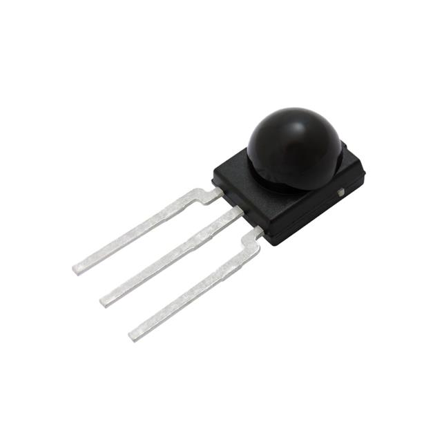
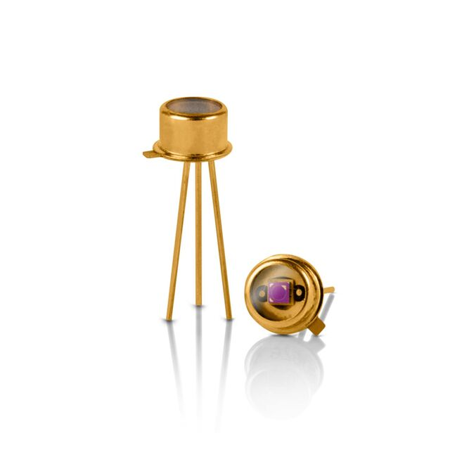
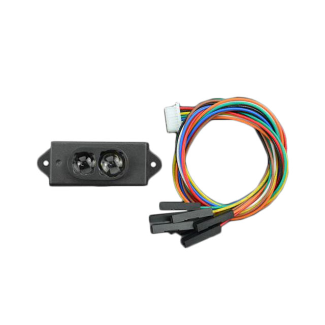
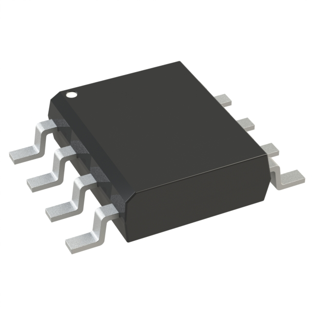
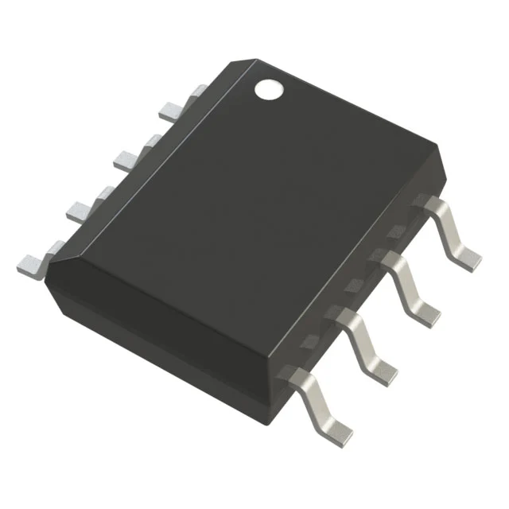

**IR Distance Sensor**

| **Solution**                                                                                                                                                                                      | **Pros**                                                                                                                                    | **Cons**                                                                                            |
| ------------------------------------------------------------------------------------------------------------------------------------------------------------------------------------------------- | ------------------------------------------------------------------------------------------------------------------------------------------- | --------------------------------------------------------------------------------------------------- |
|  Option 1.  TSSP53038 SENSOR OPT 940NM IR RADIAL 3  $0.84/each [link to product](https://www.digikey.com/en/products/detail/vishay-semiconductor-opto-division/TSSP53038/20379937)                 | \* Inexpensive \* Falls under voltage constraints \* Easy to mount to PCB                                               | \* Requires external components and support circuitry for interface \* Needs special PCB layout. |
|  \* Option 2.  \* CTX936TR-ND surface mount oscillator  \* $1/each  \* [Link to product](http://www.digikey.com/product-detail/en/636L3I001M84320/CTX936TR-ND/2292940) | \* Outputs a square wave  \* Stable over operating temperature   \* Direct interface with PSoC (no external circuitry required) range | * More expensive  \* Slow shipping speed                                                         |
|  \* Option 3.  \* SEN0413 SENSOR OPT 850NM IR MODULE  \* $19.90/each  \* [Link to product](https://www.digikey.com/en/products/detail/dfrobot/SEN0413/14322644) | \* Outputs a square wave  \* Stable over operating temperature   \* Direct interface with PSoC (no external circuitry required) range | * More expensive  \* Slow shipping speed                                                         |

**Choice:** Option 2. TSSP53038 SENSOR OPT 940NM IR RADIAL 3

**Rationale:** This sensor is both the cheapest and easiest to work with.

**Audio Amp**

| **Solution**                                                                                                                                                                                      | **Pros**                                                                                                                                    | **Cons**                                                                                            |
| ------------------------------------------------------------------------------------------------------------------------------------------------------------------------------------------------- | ------------------------------------------------------------------------------------------------------------------------------------------- | --------------------------------------------------------------------------------------------------- |
|  Option 1.  PAM8302AADCR IC AMP CLASS D MONO 2.5W 8SOP  $0.48/each [link to product](https://www.digikey.com/en/products/detail/diodes-incorporated/PAM8302AADCR/4033280)                 | \* Inexpensive \* Falls under voltage constraints \*                                                | \* Surface mounted component \* Needs special PCB layout. |
|  \* Option 2.  \* CTX936TR-ND surface mount oscillator  \* $1/each  \* [Link to product](http://www.digikey.com/product-detail/en/636L3I001M84320/CTX936TR-ND/2292940) | \* Outputs a square wave  \* Stable over operating temperature   \* Direct interface with PSoC (no external circuitry required) range | * More expensive  \* Slow shipping speed                                                         |
|  \* Option 3.  \* SEN0413 SENSOR OPT 850NM IR MODULE  \* $19.90/each  \* [Link to product](https://www.digikey.com/en/products/detail/dfrobot/SEN0413/14322644) | \* Outputs a square wave  \* Stable over operating temperature   \* Direct interface with PSoC (no external circuitry required) range | * More expensive  \* Slow shipping speed                                                         |

**Choice:** Option 1. PAM8302AADCR IC AMP CLASS D MONO 2.5W 8SOP

**Rationale:** This Audio amp is the only one I could find that fell within the desired voltage constraints.

**Speaker**

| **Solution**                                                                                                                                                                                      | **Pros**                                                                                                                                    | **Cons**                                                                                            |
| ------------------------------------------------------------------------------------------------------------------------------------------------------------------------------------------------- | ------------------------------------------------------------------------------------------------------------------------------------------- | --------------------------------------------------------------------------------------------------- |
|  Option 1.  PAM8302AADCR IC AMP CLASS D MONO 2.5W 8SOP  $0.48/each [link to product](https://www.digikey.com/en/products/detail/diodes-incorporated/PAM8302AADCR/4033280)                 | \* Inexpensive \* Falls under voltage constraints \*                                                | \* Surface mounted component \* Needs special PCB layout. |
|  \* Option 2.  \* CTX936TR-ND surface mount oscillator  \* $1/each  \* [Link to product](http://www.digikey.com/product-detail/en/636L3I001M84320/CTX936TR-ND/2292940) | \* Outputs a square wave  \* Stable over operating temperature   \* Direct interface with PSoC (no external circuitry required) range | * More expensive  \* Slow shipping speed                                                         |
|  \* Option 3.  \* SEN0413 SENSOR OPT 850NM IR MODULE  \* $19.90/each  \* [Link to product](https://www.digikey.com/en/products/detail/dfrobot/SEN0413/14322644) | \* Outputs a square wave  \* Stable over operating temperature   \* Direct interface with PSoC (no external circuitry required) range | * More expensive  \* Slow shipping speed                                                         |

**Choice:** Option 1. PAM8302AADCR IC AMP CLASS D MONO 2.5W 8SOP

**Rationale:** This Audio amp is the only one I could find that fell within the desired voltage constraints.

**Op-Amp**

| **Solution**                                                                                                                                                                                      | **Pros**                                                                                                                                    | **Cons**                                                                                            |
| ------------------------------------------------------------------------------------------------------------------------------------------------------------------------------------------------- | ------------------------------------------------------------------------------------------------------------------------------------------- | --------------------------------------------------------------------------------------------------- |
|  Option 1.  PAM8302AADCR IC AMP CLASS D MONO 2.5W 8SOP  $0.48/each [link to product](https://www.digikey.com/en/products/detail/diodes-incorporated/PAM8302AADCR/4033280)                 | \* Inexpensive \* Falls within voltage constraints \* Does not generate much heat                          | \* Surface mounted component \* Needs special PCB layout. |
|  \* Option 2.  \* IS31AP4991A-GRLS2-TR IC AMP CLASS AB MONO 1.15W 8SOIC  \* $0.41/each  \* [Link to product](https://www.digikey.com/en/products/detail/lumissil-microsystems/IS31AP4991A-GRLS2-TR/5319733) | \* Great sound quality  \* Falls within voltage constraints   \* Inexpensive | \* Moderate heat generation  \* Slow shipping speed                                                         |
|  \* Option 3.  \* SEN0413 SENSOR OPT 850NM IR MODULE  \* $19.90/each  \* [Link to product](https://www.digikey.com/en/products/detail/dfrobot/SEN0413/14322644) | \* Outputs a square wave  \* Stable over operating temperature   \* Direct interface with PSoC (no external circuitry required) range | * More expensive  \* Slow shipping speed                                                         |

**Choice:** Option 1. PAM8302AADCR IC AMP CLASS D MONO 2.5W 8SOP

**Rationale:** This audio amp is the class D amplifier I could find that fell within the desired voltage constraints.

**Voltage Regulator**

| **Solution**                                                                                                                                                                                      | **Pros**                                                                                                                                    | **Cons**                                                                                            |
| ------------------------------------------------------------------------------------------------------------------------------------------------------------------------------------------------- | ------------------------------------------------------------------------------------------------------------------------------------------- | --------------------------------------------------------------------------------------------------- |
|  Option 1.  AP7375-33SA-7 IC REG LIN 3.3V 300MA SOT23-3  $0.48/each [link to product](https://www.digikey.com/en/products/detail/diodes-incorporated/PAM8302AADCR/4033280)                 | \* Inexpensive \* Falls under voltage constraints \*                                                | \* Surface mounted component \* Needs special PCB layout. |
|  \* Option 2.  \* CTX936TR-ND surface mount oscillator  \* $1/each  \* [Link to product](http://www.digikey.com/product-detail/en/636L3I001M84320/CTX936TR-ND/2292940) | \* Outputs a square wave  \* Stable over operating temperature   \* Direct interface with PSoC (no external circuitry required) range | * More expensive  \* Slow shipping speed                                                         |
|  \* Option 3.  \* SEN0413 SENSOR OPT 850NM IR MODULE  \* $19.90/each  \* [Link to product](https://www.digikey.com/en/products/detail/dfrobot/SEN0413/14322644) | \* Outputs a square wave  \* Stable over operating temperature   \* Direct interface with PSoC (no external circuitry required) range | * More expensive  \* Slow shipping speed                                                         |

**Choice:** Option 1. PAM8302AADCR IC AMP CLASS D MONO 2.5W 8SOP

**Rationale:** This Audio amp is the only one I could find that fell within the desired voltage constraints.
