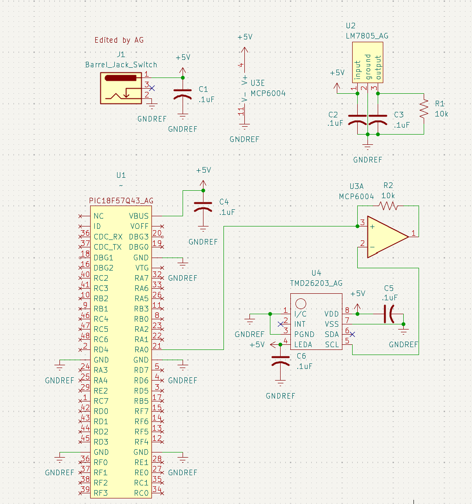

## Overview

This schematic shows the connections between the PIC nano, IR sensor, and speaker. Its purpose is to help the reader understand the circuit that my component needs to function with the rest of the boards and the voltage regulations required for this component to operate properly. 

{style width:"350" height:"300;"}
**Figure ##:** Showing a example schematic.

## Resouces

The schematic as a PDF download is available [*here*](Garcia_IndSchematicDesign.pdf), and the Zip folder of the project [*here*](Garcia_IndSchematicDesign.zip).