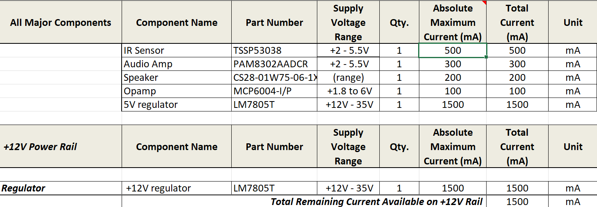
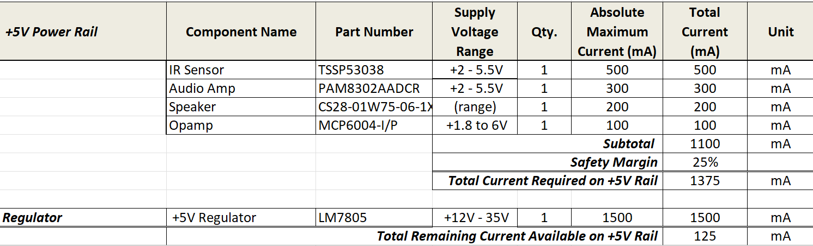

## Overview
The power budget is used to show help us ensure that all the components will operate together. The sheet is sectioned into major components, the components on the +12V rail, and the components on the +5V rail. Then I calculated the current draw from the components because to ensure that it is less than the maximum current provided with a 25% safety margin.

{style width:"350" height:"300;"}

{style width:"350" height:"300;"}

## Conclusions

The power budget that I have created shows that the components I have selected will operate because of the the surplus current that was calculated.

## Resouces

The power budget as a PDF download is available [*here*](Garcia_PowerBudget.pdf), and a Microsoft Excel Sheet [*here*](Garcia_PowerBudget.xlsx).